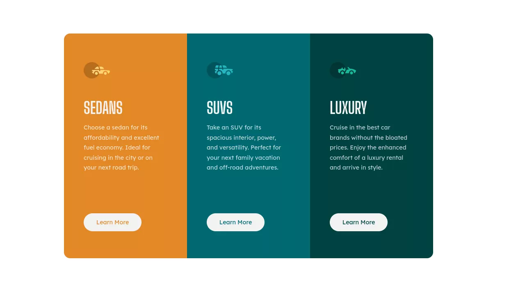

# Frontend Mentor - 3-column preview card component solution

This is a solution to the [3-column preview card component challenge on Frontend Mentor](https://www.frontendmentor.io/challenges/3column-preview-card-component-pH92eAR2-). Frontend Mentor challenges help you improve your coding skills by building realistic projects. 

## Table of contents

- [Overview](#overview)
  - [The challenge](#the-challenge)
  - [Screenshot](#screenshot)
  - [Links](#links)
- [My process](#my-process)
  - [Built with](#built-with)
  - [What I learned](#what-i-learned)
  - [Useful resources](#useful-resources)
- [Author](#author)
- [Acknowledgments](#acknowledgments)

## Overview

### The challenge

Users should be able to:

- View the optimal layout depending on their device's screen size
- See hover states for interactive elements

### Screenshot



### Links

- [Solution](https://github.com/jglopezre/three-column-preview-card-component.git)
- [Live View](https://jglopezre.github.io/three-column-preview-card-component/)

## My process

### Built with

- Semantic HTML5 markup
- Flexbox
- [SASS](https://sass-lang.com/) - SCSS Languaje

### What I learned

This challenge allow me to practicing more with auto-selection tags like `*:nth-child()` of CSS and nested values on SCSS using SASS languaje for styles. Instead I used flex-box for sorting elements, the flex-wrap it was not better way to sort elements in mobile view, for solving this, I used `@media` css property and set break width resolution for changing some values and sort all card into a column. 


```scss
@media  screen and (max-width: 900px)
```
```scss
@media  screen and (min-width: 901px)
```

Theese lines exchanges settings from some values like `flex-direction:` and `border-radius:` to improve visualitation on several resolution devices.

### Useful resources

- [W3school](https://www.w3schools.com/) - There are all information about HTML and CSS. Nothing more to tell.
- [A Complete Guide to Flexbox](https://css-tricks.com/snippets/css/a-guide-to-flexbox/#flexbox-background) - There are a complte guide about flex.

## Author

- Website - [Javier López](http://javierglopezreques.tk/)
- Frontend Mentor - [@jglopezre](https://www.frontendmentor.io/profile/jglopezre)

## Acknowledgments

Please, try to understand CSS behavior. The way you chose to complete the challenge always is correct, but always exist a better way to make it possible. 
